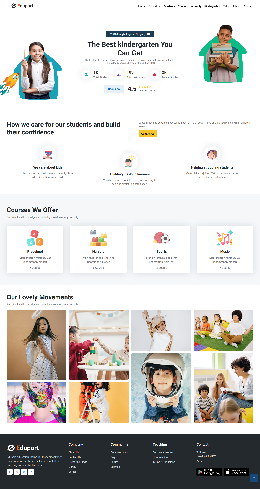

# Eduport

## Description
Eduport is a web platform that helps students browse available courses and universities, making it easier for them to find educational opportunities.

## Main Actor
- **Students** – The primary users of the platform, browsing and exploring courses and universities.

## Features & Functionality
- **Browse Courses** – Students can explore available courses.  
- **Browse Universities** – Students can view different universities and their details.  
- **Search & Filter** – Students can search for specific courses or universities.

## Tech Stack
- **Next.js** – For building the frontend with server-side rendering and routing.  
- **Tailwind CSS** – For styling and responsive design.

### Screenshots
Here are some screenshots from Store:

